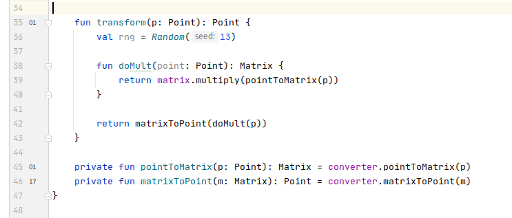

# Profiling Icons Plugin for Intellij IDEA

<!-- Plugin description -->
The plugin annotates Java/Kotlin methods with gutter icons that display the approximate
percentage of time that method was executed during the profiling. The profiler snapshot
to visualize is loaded using the Tools/Load Profiler Snapshot menu action.

The plugin is a work in progress. It currently supports Async Profiler
flat text snapshots only.
<!-- Plugin description end -->

## Installation

The plugin has not yet been released. After the release, it can be installed using the common procedures.

- Using IDE built-in plugin system:
  
  <kbd>Settings/Preferences</kbd> > <kbd>Plugins</kbd> > <kbd>Marketplace</kbd> > <kbd>Search for "profiling-icons-plugin"</kbd> >
  <kbd>Install Plugin</kbd>
  
- Manually:

  Download the [latest release](https://github.com/dtim/profiling-icons-plugin/releases/latest) and install it manually using
  <kbd>Settings/Preferences</kbd> > <kbd>Plugins</kbd> > <kbd>⚙️</kbd> > <kbd>Install plugin from disk...</kbd>

## Screenshots

### Profiler snapshot fragment

### Tools menu action

### Snapshot loading dialog

### Markers and tooltips

## TODO / Planned

  * Improve name matching between the profiler snapshot and the code.
    * Provide icons for lambda abstractions, anonymous classes,
      and nested functions.
    * Use method signatures and line numbers if they are present
      in the snapshot.
    
  * Implement additional parsers.
    * Java Flight Recorder.
    * YourKit.
  
  * Provide a toolbar with additional information from a snapshot.
    * Stack trace and method call tree.
    * Statistics for the native code involved. 

---
Plugin based on the [IntelliJ Platform Plugin Template][template].

[template]: https://github.com/JetBrains/intellij-platform-plugin-template
